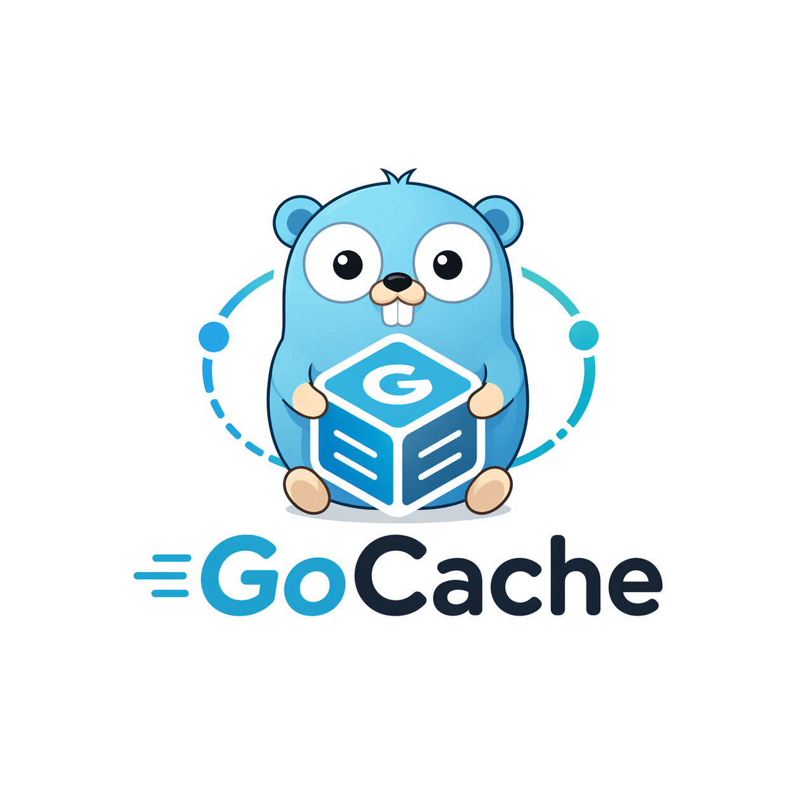
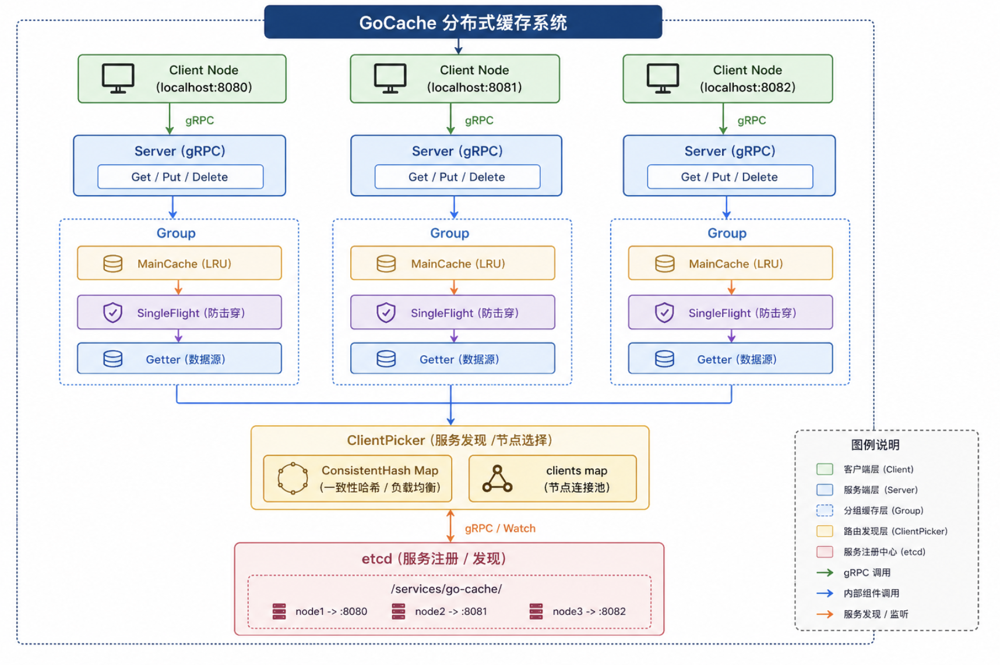
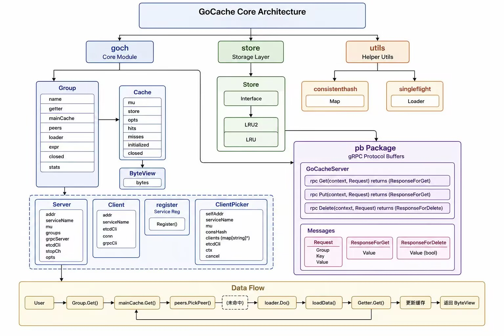
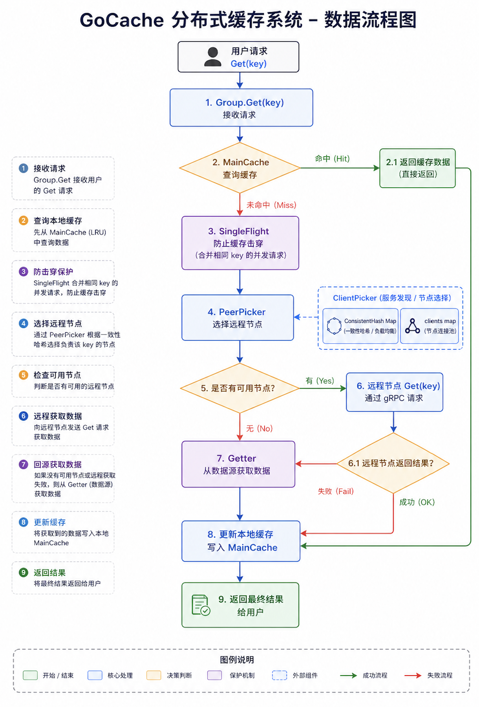

<p align="center">
  
</p>

<h1 align="center">GoCache</h1>

<p align="center">
  一个围绕缓存组设计的 Go 分布式缓存项目，使用 etcd 进行服务发现，使用 gRPC 完成节点通信，并通过一致性哈希选择缓存节点。
</p>

<p align="center">
  <a href="LICENSE"></a>
  
  
</p>

## 项目介绍

GoCache 是一个用 Go 编写的分布式缓存项目。用户主要通过 `goch.Group` 操作缓存，每个缓存组都是独立的缓存命名空间。项目支持单节点本地缓存，也支持多节点分布式缓存：节点通过 etcd 注册和发现，通过 gRPC 通信，并使用一致性哈希选择 key 对应的 peer 节点。

详细 API 和完整用法请阅读 [docs/usage.md](docs/usage.md)。

<p align="center">
  
</p>

## 功能特性

- 以缓存组为核心的用户 API，通过 `Group.Get`、`Group.Put`、`Group.Delete` 操作缓存。
- 使用 gRPC 实现多节点之间的 peer 通信。
- 使用 etcd 完成服务注册与服务发现。
- 使用一致性哈希选择 key 对应的缓存节点。
- 内置 singleflight 加载机制，降低高并发缓存击穿风险。
- 支持可配置的本地缓存实现，包括 LRU 和 LRU2。
- 支持缓存过期时间。
- 提供缓存组运行统计信息。
- 已补充并发测试和 race detector 验证，覆盖程序级数据竞争与死锁风险。

## 架构设计

GoCache 的核心设计分为用户 API、本地缓存、分布式 peer 选择、节点通信和注册中心几部分。

<p align="center">
  
</p>

数据读取流程大致如下：

1. 用户通过 `Group.Get(ctx, key)` 读取数据。
2. 先查询当前节点本地缓存。
3. 本地未命中时，通过一致性哈希判断 key 是否应由其他节点负责。
4. 如果命中远端 peer，则通过 gRPC 请求远端节点同名缓存组。
5. 如果没有可用 peer 或远端失败，则调用用户提供的 `Getter` 从数据源加载。
6. 加载成功后写回本地缓存。

<p align="center">
  
</p>

## 运行环境

- Go 1.25+
- etcd 3.x，分布式模式需要
- macOS、Linux 或其他 Go 支持的平台
- gRPC 相关代码已随仓库提交在 `pb/` 目录下，正常使用不需要重新生成

## 安装方式

在已有 Go 项目中使用：

```bash
go get github.com/kiritosuki/GoCache
```

克隆本仓库：

```bash
git clone https://github.com/kiritosuki/GoCache.git
cd GoCache
go mod download
```

## 快速开始

### 本地缓存

本地缓存只需要创建一个缓存组，并提供缓存未命中时的数据加载函数。

```go
package main

import (
	"context"
	"fmt"
	"time"

	"github.com/kiritosuki/GoCache/goch"
)

func main() {
	db := map[string]string{"Tom": "630"}

	group := goch.NewGroup("scores", 1<<20, goch.GetterFunc(
		func(ctx context.Context, key string) ([]byte, error) {
			if v, ok := db[key]; ok {
				return []byte(v), nil
			}
			return nil, fmt.Errorf("%s not found", key)
		},
	), goch.WithExpr(time.Minute))
	defer group.Close()

	view, err := group.Get(context.Background(), "Tom")
	if err != nil {
		panic(err)
	}
	fmt.Println(view.String())
}
```

可运行示例：

```bash
go run ./example/local_cache
```

### 分布式缓存

先启动 etcd：

```bash
etcd
```

启动两个 GoCache 节点：

```bash
go run ./example/distributed_node -addr 127.0.0.1:18001 -service go-cache-example
go run ./example/distributed_node -addr 127.0.0.1:18002 -service go-cache-example -probe-key key3
```

更多接口说明和分布式启动流程请参考 [docs/usage.md](docs/usage.md)。

## 项目结构

```text
.
├── goch/                 # 用户 API、缓存组、gRPC server/client、peer picker
├── store/                # 本地缓存存储实现，包含 LRU 和 LRU2
├── register/             # etcd 服务注册逻辑
├── pb/                   # protobuf 和生成后的 gRPC 代码
├── utils/                # singleflight、一致性哈希等工具
├── example/              # 本地和分布式使用示例
├── test/                 # 并发和分布式程序级测试
├── docs/                 # 使用文档
└── pic/                  # logo、架构图、组件图、流程图
```

## 测试

运行全部测试：

```bash
go test ./...
```

运行并发和分布式测试：

```bash
go test ./test
```

使用 race detector 检查数据竞争：

```bash
go test -race ./...
go test -race -count=1 ./test
```

说明：`./test` 中的分布式测试会使用本机 etcd 和多个 localhost gRPC 端口。如果 etcd 不可用，测试会自动跳过分布式部分。

## 使用注意事项

- 业务代码优先使用 `goch.Group`，不要直接绕过缓存组调用 gRPC 接口。
- 同一个分布式集群中的节点应使用相同的 `serviceName` 和缓存组名。
- 节点地址建议使用明确可达的 `ip:port`，例如 `127.0.0.1:18001` 或局域网 IP。
- `goch.Server` 主要用于接收 peer 请求；`goch.ClientPicker` 负责服务发现和 peer 选择。

## 文档

- [使用文档](docs/usage.md)
- [本地缓存示例](example/local_cache/main.go)
- [分布式节点示例](example/distributed_node/main.go)

## 后续计划

- 提供更完整的服务发现配置能力。
- 增加更清晰的服务端优雅关闭 API。
- 补充更系统的 benchmark。
- 扩展更多本地缓存存储实现。
- 增强可观测性和指标导出能力。

## 贡献指南

欢迎提交 issue 和 pull request。建议在提交前完成以下检查：

```bash
gofmt -w .
go test ./...
go test -race ./...
```

提交 PR 时请说明：

- 变更目的
- 核心实现思路
- 已运行的测试命令
- 是否影响公开 API 或现有行为

## 开源协议

GoCache 基于 [MIT License](LICENSE) 开源。
